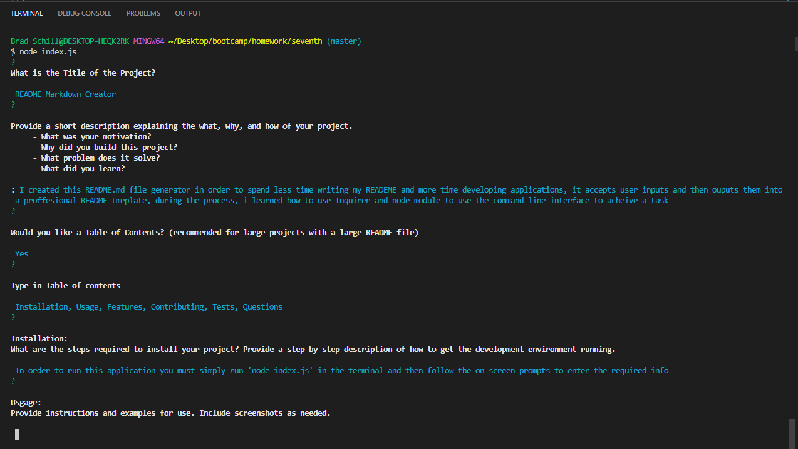

# README Markdown Generator

## Description

The Motivation for this project was to spend less time writing future README.md files and more time working on the projects themselves. This Generator quickly creates a README markdown file that can be used for any and all future projects. During the development I learned how to use node and inquirer to take input from the user  through the command line and then use those inputs to create the README unique to their project. (This README.md was created using the Generator)

## Table of Contents 

- [Installation](#installation})
- [Usage](#usage})
- [License](#license)
- [Features](#features)
- [Contributing](#contributing)
- [Tests](#tests)
- [Questions](#questions)

## Installation

In order to install, you must go to my Github (link below) and then pull the file to your local computer. Thats it.

## [Usage](https://drive.google.com/file/d/1EStVQw3D2e-pQF9hatZE5sgx9B2GMr3h/view)

To use the program simply open up the directory in an integrated terminal and then run 'node index.js', then answer all of the prompts and your read me will be output in the file named 'Generated_README.md' Each time you run the application the file will be overwritten with your new README.md file. *Click the Usage link for A Video Demonstration*

## License

## Features

Accept user inputs, Output proffesional README.md file, Create Badges with links to selected License description    

## Contributing

Feel free to contribute in any way you desire, this is open to anyone to explore and improve    

## Tests

In order to test the application, pull the repo and start running the script, If you find any bugs in the code please feel frree to contact with suggestions    

## Questions

Im happy to answer any Questions you may have, my preferred method is email (link below)    

## Contact Info

